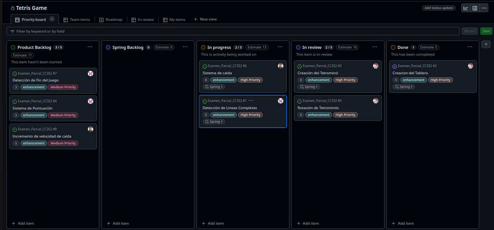

# Tetris en Consola

## 1. Configuración inicial del tablero Kanban y el Product Backlog

- **Tablero Kanban**: Se creó el tablero Kanban en GitHub para gestionar y visualizar el progreso del proyecto. El tablero contiene las siguientes columnas:
  - **Backlog**: Todas las tareas que aún no han sido trabajadas.
  - **In Progress**: Tareas que están siendo implementadas.
  - **In Review**: Tareas listas para ser revisadas.
  - **Done**: Tareas completadas.


 - Historias clave para el Proyecto:
    - **Creacion del Tablero.**
    - **Creacion del Tetrominó.**
    - **Rotacion de Tetrominós.**
    - **Detección de Líneas Completas**
    - **Incremento de la velocidad de caída**
    - **Sistema de Puntuación**
    - **Deteccion de Fin del Juego**

## 2. Historias de usuario con criterios de aceptación en Gherkin

Se escribieron las historias de usuario utilizando la sintaxis Gherkin para facilitar la definición clara de criterios de aceptación.

### Se crearon las siguientes historias de usuario

**Historia de Usuario 1: Creacion del Tablero**

- **As a** jugador
- **I need** un tablero donde los tetrominós caigan y se acumulen
- **So that** pueda organizar las piezas para completar líneas y seguir jugando.

### Details and Assumptions
* El tablero tiene un tamaño estándar (por ejemplo, 12 columnas x 25 filas).
* Los tetrominós deben caer dentro del tablero, y una vez que colisionen con el fondo o con otras piezas, deben detenerse.
* El tablero debe actualizarse visualmente en cada movimiento de las piezas.

```gherkin
Given el tablero de juego ha sido creado
When el jugador inicia el juego
Then el tablero debe aparecer vacío y las piezas deben caer dentro de sus límites
```
**Historia de Usuario 2: Creación del Tetrominó**

- **As a** jugador
- **I need** crear un tetrominó que pueda caer y moverse dentro del tablero
- **So that** pueda organizar y rotar las piezas para completar líneas y seguir jugando

### Details and Assumptions
* Los tetrominós pueden ser de diferentes formas (por ejemplo, I, J, L, O, S, T, Z).
* Cada tetrominó debe definirse en una matriz de 4x4.
* El tetrominó debe poder moverse hacia la izquierda, derecha y hacia abajo.
* El jugador debe poder rotar el tetrominó utilizando las teclas de dirección.
* Los tetrominós deben caer desde la parte superior del tablero y detenerse al colisionar con el fondo o con otras piezas.

```gherkin
Given un tetrominó ha sido creado
When el jugador inicia el juego
Then el tetrominó debe aparecer en la parte superior del tablero
And el jugador debe poder moverlo a la izquierda, derecha y hacia abajo
And el jugador debe poder rotar el tetrominó usando la tecla de rotación
```

**Historia de Usuario 3: Rotación de Tetrominós**

- **As a** jugador
- **I need** poder rotar los tetrominós
- **So that** pueda ajustarlos para completar líneas en el tablero

### Details and Assumptions
* Los tetrominós deben rotar 90 grados en el sentido de las agujas del reloj.
* No deben rotar si están bloqueados por otros bloques o los bordes del tablero.

```gherkin
Given un tetromino está cayendo
When el jugador presiona la tecla de rotación
Then el tetromino rota 90 grados si no hay obstrucciones
```

**Historia de Usuario 4: Sistema de caída**

- **As a** Desarrollador 
- **I need** implementar un sistema de caída de piezas
- **So that** para que el juego tenga un correcto funcionamiento

### Details and Assumptions
* El sistema de caída tiene que ser el mismo para todas las partidas de juego

```gherkin
Given que el juego esta en curso
When aparece una pieza de juego
Then esta pieza empieza a simular un efecto de caida
```

**Historia de Usuario 5: Detección de Líneas Completas**

- **As a** jugador
- **I need** que las líneas completas desaparezcan cuando están llenas
- **So that** pueda liberar espacio en el tablero y seguir jugando.

### Details and Assumptions
* El tablero detecta cuando una fila está completamente llena de bloques y elimina esa fila.
* Las filas superiores deben caer una posición después de que una línea desaparece.


```gherkin
Given el jugador ha colocado bloques en el tablero
When una línea del tablero se completa
Then la línea debe desaparecer y las filas superiores deben caer
```
**Historia de Usuario 6: Incremento de velocidad de caída**

- **As a** jugador
- **I need** que la velocidad del juego aumente con el tiempo
- **So that** el juego se vuelva más desafiante

### Details and Assumptions
* La velocidad del juego debe aumentar gradualmente con el tiempo
* Los tetrominos deben caer más rápido a medida que se este más tiempo en el juego


```gherkin
Given el juego está en curso
When el jugador ya esta jugando un tiempo considerable
Then las piezas del juego simulan una caída más rápida
```

**Historia de Usuario 7: Sistema de Puntuación**

- **As a** jugador
- **I need** un sistema de puntuación que se actualice cuando completo líneas
- **So that** ver cuantos puntos he ganado

### Details and Assumptions
* El juego debe registrar la puntuación, que debe incrementarse cuando el jugador completa una o más líneas.
* El puntaje debe mostrarse al jugador en tiempo real.

```gherkin
Given el jugador completa una línea
When la línea desaparece del tablero
Then la puntuación debe incrementarse en función de las líneas eliminadas
```

**Historia de Usuario 8: Detección de Fin del Juego**

- **As a** jugador 
- **I need** que el juego termine cuando los tetrominós lleguen a la parte superior del tablero
- **So that** se finalice la partida y se muestre mi puntaje final

### Details and Assumptions
* El juego debe terminar si los tetrominós llenan el tablero hasta la parte superior.
* Debe mostrarse un mensaje de "Game Over" y la puntuación final.

```gherkin
Given los tetrominós llenan la parte superior del tablero
When no hay más espacio para que caiga otro tetromino
Then el juego termina y se muestra el puntaje final
```

En cada historia de usuario se empleo el siguiente template:


## 3. Labels sugeridos y su uso

Se crearon algunos labels para luego asignarlos a cada historia de usuario, segun sus características y funcionalidad

### 1. Segun su Prioridad

- **high priority**: Para indicar que una historia de usuario o tarea es de alta prioridad.
- **medium priority**: Para elementos de prioridad media.
- **low priority**: Para ítems que no requieren atención inmediata.

### 2. Segun su tipo de tarea

- **enhancement**: Etiqueta para mejoras solicitadas o nuevas características que se desean agregar al proyecto. Se usa para separar las mejoras o nuevas funcionalidades de los problemas existentes.

## 4. Añadir labels a las historias

Procederemos a etiquetar cada historia de usuario con su label correspondiente , segun su funcionalidad y función.

**Historia de Usuario 1: Creacion del Tablero**

- **Label:** ```high priority```
- **Justificación:** El tablero es esencial para el juego. Todas las demás funcionalidades dependen de su existencia, por lo que es prioritario implementarlo.

- **Label:** ```enhancement```
- **Justificación:** La creación del tablero es una característica central del juego. Sin un tablero, no se puede ejecutar el juego, ya que es donde ocurren todas las interacciones.


**Historia de Usuario 2: Creacion del Tetrominó**

- **Label:** ```high priority```
- **Justificación:** La creación del tetrominó es una funcionalidad fundamental para el juego de Tetris. Sin los tetrominós, no habría piezas para jugar, lo que hace que esta característica sea esencial para el funcionamiento básico del juego. 
- **Label:** ```enhancement```
- **Justificación:** Se aplica porque la creación del tetrominó es una nueva característica que mejora significativamente la funcionalidad del juego.

**Historia de Usuario 3: Rotacion de Tetrominós**

- **Label:** ```high priority```
- **Justificación:** La rotación es fundamental para la jugabilidad, ya que sin esta opción, el jugador no podría colocar los tetrominós de forma estratégica, afectando negativamente la experiencia de juego.
- **Label:** ```enhancement```
- **Justificación:** La rotación de tetrominós es una característica esencial del juego de Tetris que permite al jugador ajustar las piezas para completar líneas de manera eficiente..

**Historia de Usuario 4: Sistema de caída**

- **Label:** ```high priority```
- **Justificación:** La funcionalidad de caída es crucial para que el juego sea jugable. Sin esta característica, no sería posible jugar, por lo que es una alta prioridad.

- **Label:** ```enhancement```
- **Justificación:** La caída de tetrominós es una funcionalidad clave en el juego de Tetris, ya que los bloques deben caer de manera automática para que el jugador pueda interactuar con ellos.


**Historia de Usuario 5: Deteccion de Lineas Completas**

- **Label:** ```high priority```
- **Justificación:** Esta funcionalidad es clave para la jugabilidad, ya que sin ella el tablero se llenaría rápidamente, haciendo que el juego sea imposible de continuar..

- **Label:** ```enhancement```
- **Justificación:** La detección de líneas completas es una de las mecánicas fundamentales de Tetris, ya que permite al jugador ganar puntos y liberar espacio en el tablero.

**Historia de Usuario 6: Incremento de velocidad de caída**

- **Label:** ```medium priority```
- **Justificación:** La velocidad de caída es crucial para la dificultad del juego, ya que afecta directamente la rapidez con que las piezas deben ser manejadas.

- **Label:** ```enhancement```
- **Justificación:** El aumento de la velocidad de caída es una característica esencial del juego de Tetris, ya que permite al jugador avanzar más rápidamente.

**Historia de Usuario 7: Sistema de Puntuacion**

- **Label:** ```medium priority```
- **Justificación:** Aunque es importante para el juego, la funcionalidad de puntuación no es esencial para que el juego funcione inicialmente. El juego puede funcionar sin un sistema de puntuación, por lo que se le asigna una prioridad media.

- **Label:** ```enhancement```
- **Justificación:** El sistema de puntuación es una característica importante del juego que permite al jugador recibir retroalimentación sobre su progreso y rendimiento.


**Historia de Usuario 8: Deteccion de Fin del Juego**

- **Label:** ```medium priority```
- **Justificación:** Aunque es necesaria para cerrar correctamente una partida, el juego puede funcionar temporalmente sin la detección del fin de juego, pero debe implementarse para ofrecer una experiencia completa.

- **Label:** ```enhancement```
- **Justificación:** La detección del fin del juego es una funcionalidad crucial que define el final de una partida, cuando el tablero está lleno de piezas.


## 5. Asignación de puntos de historia

Para asignar puntos de historia a cada una de las historias de usuario del proyecto, tomaremos en cuenta la **complejidad**, el **esfuerzo** requerido y la **incertidumbre**. Utilizaré la **secuencia de Fibonacci** (1, 2, 3, 5, 8, 13, etc.) como referencia, donde:

- **1 punto**: Historia muy simple, poca o ninguna complejidad.
- **2 puntos**: Relativamente sencilla, con poco esfuerzo o complejidad.
- **3 puntos**: Moderada complejidad, requerirá más esfuerzo pero no demasiada incertidumbre.
- **5 puntos**: Historia compleja, con más trabajo y algún nivel de incertidumbre.
- **8 puntos**: Historia con mucha complejidad o incertidumbre, que requerirá un esfuerzo considerable.
- **13 puntos**: Historia muy compleja con alta incertidumbre, probablemente requiera bastante investigación.

**Historia de Usuario 1: Crear Tablero**

- **Puntos de historia :** ```5```
- **Justificación:** La creación del tablero requiere definir una estructura inicial de datos y la lógica básica de renderización. Aunque es esencial, no presenta mucha complejidad técnica, pero puede necesitar iteraciones y pruebas para que funcione bien.

**Historia de Usuario 2: Creacion de Tetrominós**

- **Puntos de historia :** ```8```
- **Justificación:** La creación de tetrominós implica una complejidad considerable y cierto nivel de incertidumbre. Se requiere definir estructuras de datos para representar las diferentes formas de las piezas.

**Historia de Usuario 3: Rotacion de Tetrominós**

- **Puntos de historia :** ```8```
- **Justificación:** La rotación de los tetrominós agrega un nivel significativo de complejidad, ya que debes asegurarte de que las piezas no atraviesen otras piezas o salgan del tablero. Además, la rotación debe funcionar en cualquier posición del tablero, lo que requiere múltiples pruebas y ajustes.


**Historia de Usuario 4: Sistema de caída**

- **Puntos de historia :** ```8```
- **Justificación:** Implementar la caída de los tetrominós implica trabajar con la lógica de la gravedad.

**Historia de Usuario 5: Deteccion de Lineas Completas**

- **Puntos de historia :** ```5```
- **Justificación:** La detección de líneas completas y su eliminación es una funcionalidad fundamental de Tetris. Aunque conceptualmente es simple, se necesita implementar la lógica para detectar la condición de una fila llena y manejar la actualización del tablero correctamente.

**Historia de Usuario 6: Incremento de velocidad de caída**

- **Puntos de historia :** ```5```
- **Justificación:** El incremento de velocidad a medida que el jugador avanza introduce una mayor dificultad técnica. Es necesario sincronizar el aumento progresivo de la velocidad con la caída de los tetrominós sin que afecte la fluidez del juego.

**Historia de Usuario 7: Sistema de Puntuacion**

- **Puntos de historia :** ```3```
- **Justificación:** La implementación del sistema de puntuación es relativamente sencilla comparada con otras funcionalidades. Solo requiere incrementar un contador basado en el número de líneas completadas, pero sigue siendo importante para el juego

**Historia de Usuario 8: Deteccion de Fin del Juego**

- **Puntos de historia :** ```3```
- **Justificación:** Detectar cuándo el tablero está lleno es una tarea de baja complejidad, ya que solo implica revisar si hay bloques en la fila superior. No es particularmente difícil desde el punto de vista técnico


## 6. Asignación de miembros a cada historia de usuario

Nos hemos asignado cada historia de usario de acuerdo a el conocimiento y la capacidad de cada uno, siendo asi la creacion de ramas especificas para cada entidad, en este caso **fallen**, **shapes1** y **punctuation**

- **Crear Tablero** Sergio Gil
- **Crear Tetrominós** Sergio Gil
- **Rotacion de Tetrominós** Sergio Gil
- **Sistema de caída** Carlos Canto
- **Deteccion de Lineas Completas** Kevin Palomino
- **Incremento de velocidad de caída** Carlos Canto
- **Sistema de Puntuacion** Kevin Palomino
- **Deteccion de Fin del Juego** Kevin Palomino

## 7. Configuración de Sprints y reacion del Spring Blacklog y

Se introduce **"Sprint"** como el nombre del campo, eligimos **"Iteration"** como el tipo de campo. Mantenmos la duración en una semana

Luego de asginar los puntos de historia estimados y un sprint, y moveremos las historias del Product Backlog al Sprint Backlog para construir nuestro plan.


Ahora que ya nos asignamos moveremos a la columna In progress para que se de a conocer que ya se esta trabajando esa historia de usuario en dicha rama.


Una vez que se termine de trabajar en la historia, es momento de solicitar una revisión.
Si se registrasto código en GitHub, este es el paso donde se haría un pull request para fusionar el código en la rama main. Movemos la historia de In Progress a Review.

Mientras se espera una revisión, se comienza a trabajar en otra historia. Tomamos la
siguiente historia de la parte superior del Sprint Backlog


Nuestro pull request para la historia inicial ha sido aprobado, y el proceso de revisión se ha
completado. Ahora, se mueve la historia **Crear Tablero** de la columna Review a la columna Done.

Hemos completado el trabajo en la segunda y tercera historia y hemos hecho otro pull request. Movemos las historias **Creacion del Tetrominó** y **Rotación de Tetrominós**  de la columna In Progress a la columna Review para solicitar una revisión, mientras que, ya esta en progeso las historias de usuario **Sistema de caída** y **Deteccion de Lineas Completas**



Nuestro pull request para las historias han sido aprobado, y el proceso de revisión se ha
completado. Ahora, se mueve las historias **Creacion del Tetrominó** y **Rotación de Tetrominós** de la columna Review a la columna Done.

Hemos completado el trabajo y hemos hecho otro pull request. Movemos las historias **Sistema de caída** y **Deteccion de Lineas Completas** de la columna In Progress a la columna Review para solicitar una revisión.


Nuestro pull request para la historia inicial ha sido aprobado, y el proceso de revisión se ha
completado. Ahora, se mueve las historias **Sistema de caída** y **Deteccion de Lineas Completas**  de la columna Review a la columna Done.

Movemos la historia **Incremento de velocidad de caída** de la columna Sprint Backlog a la columna In Progress.


Hemos completado el trabajo y hemos hecho otro pull request. Movemos la historia **Incremento de velocidad de caída** de la columna In Progress a la columna Review para solicitar una revisión.

Movemos las historias **Sistema de Puntuacion** y **Deteccion de Fin del Juego** de la columna Sprint Backlog a la columna In Progress.


Nuestro pull request para la historia inicial ha sido aprobado, y el proceso de revisión se ha
completado. Ahora, se mueve las historias **Incremento de velocidad de caída**  de la columna Review a la columna Done.

Hemos completado el trabajo y hemos hecho otro pull request. Movemos las historias **Sistema de Puntuacion** y **Deteccion de Fin del Juego** de la columna In Progress a la columna Review para solicitar una revisión.


Nuestro pull request ha sido aprobado, y el proceso de revisión se ha
completado. Ahora, se mueve las historias **Sistema de Puntuacion** y **Deteccion de Fin del Juego**  de la columna Review a la columna Done.


## 8. Configuracion del Burndown Char


Este grafico nos muestra la cantidad de  puntos de historias totales que se le asigno a cada miembro y que perntencen al sprint


